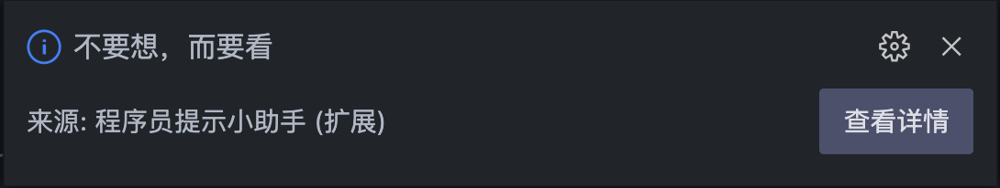
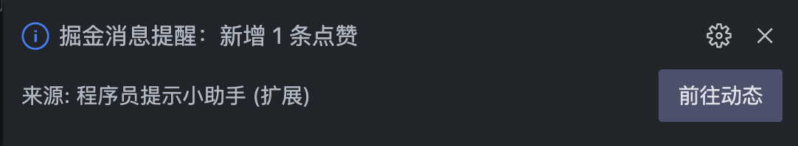

# 程序员提醒插件

程序员编程法则提示，创作平台掘金消息动态提醒。

[](https://marketplace.visualstudio.com/items?itemName=jecyu.coder-reminder)
[](https://marketplace.visualstudio.com/items?itemName=jecyu.coder-reminder)

[](https://github.com/jecyu/vscode-coder-reminder)
[](https://github.com/jecyu/vscode-coder-reminder/blob/master/LICENSE)
## 1. 功能

### 1.1 程序员编程语录提示


### 1.2 掘金消息提醒



## 2. 设置

### 2.1 程序员编程语录提示配置

`coder.remindCustomContentList`
```json
[
  {
    "title": "理解系统",
    "detail": "阅读手册，逐字逐句阅读整个手册，知道什么是正常的"
  },
  {
    "title": "制造失败",
    "detail": "从头开始，引发失败，但不要模拟失败"
  },
  {
    "title": "不要想，而要看",
    "detail": "观察失败，查看细节，不要害怕深入研究"
  },
  {
    "title": "分而治之",
    "detail": "缩小搜索范围，从有问题的支路开始查找问题"
  }
],
```

`coder.codeRuleRemind.enabled` 打开/关闭正在编程语录提醒

### 2.2 掘金消息提醒

- `coder.juejinCookie` 掘金的 cookie，用于获取消息提醒等功能

- `coder.juejinRemind.enabled` 打开/关闭掘金消息提醒

注意: 所有选项的更改都需要重启 VS Code 才能生效.
## 3. 已知问题

暂无。

## 4. 发布日志

### 1.0.0

- 支持程序员编程语录提示
- 支持掘金消息提示

## 5. 反馈

插件正在开发中, 可能会出现不稳定的现象, 任何任何 bug 或建议可以通过 [issue](https://github.com/jecyu/vscode-coder-reminder/issues/new) 反馈, 关于本插件的功能有更好的想法和建议也欢迎告知

